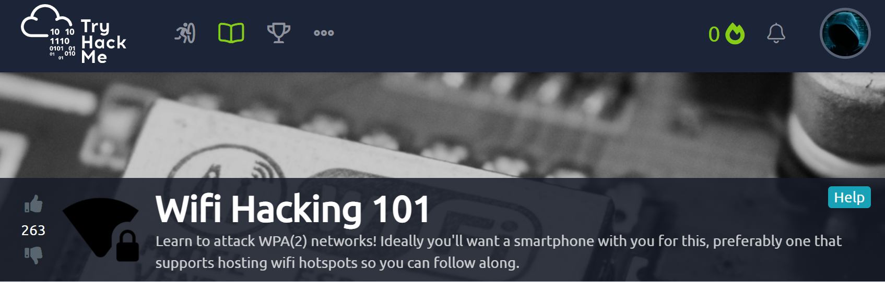

# TryHackMe
  https://tryhackme.com/room/wifihacking101
  


# Task 1  The basics - An Intro to WPA
What type of attack on the encryption can you perform on WPA(2) personal?

Answer-```Brute Force```

Can this method be used to attack WPA2-EAP handshakes? (Yea/Nay)

Answer-```Nay``` Initialization vecors are needed to crack

What three letter abbreviation is the technical term for the "wifi code/password/passphrase"?

Answer-```PSK```  (preshared key)

What's the minimum length of a WPA2 Personal password?

Answer-```8```

# Task 2  You're being watched - Capturing packets to attack
Using the Aircrack-ng suite, we can start attacking a wifi network. This will walk you through attacking a network yourself, assuming you have a monitor mode enabled NIC.

I suggest creating a hotspot on a phone/tablet, picking a weak password (From rockyou.txt) and following along with every stage. To generate 5 random passwords from rockyou, you can use this command on Kali:

command to use is ```head /usr/share/wordlists/rockyou.txt -n 10000 | shuf -n 5 -```

You will need a monitor mode NIC in order to capture the 4 way handshake. Many wireless cards support this, but it's important to note that not all of them do.

To do this ran commands below>>>>

```apt update
apt update
apt install bc -y
git clone https://github.com/cilynx/rtl88x2BU_WiFi_linux_v5.3.1_27678.20180430_COEX20180427-5959.git
cd rtl88x2BU_WiFi_linux_v5.3.1_27678.20180430_COEX20180427-5959
VER=$(sed -n 's/\PACKAGE_VERSION="\(.*\)"/\1/p' dkms.conf)
sudo rsync -rvhP ./ /usr/src/rtl88x2bu-${VER}
sudo dkms add -m rtl88x2bu -v ${VER}
sudo dkms build -m rtl88x2bu -v ${VER}
sudo dkms install -m rtl88x2bu -v ${VER}
sudo modprobe 88x2bu
```
I needed dkms
```sudo apt-get install dkms```

Next command failed

```sudo dkms build -m rtl88x2bu -v ${VER}```

kali needs updated>>>

```sudo apt-get update && sudo apt-get upgrade && sudo apt-get dist-upgrade
sudo dkms build -m rtl88x2bu -v ${VER}
sudo dkms install -m rtl88x2bu -v ${VER}
sudo modprobe 88x2bu
```


